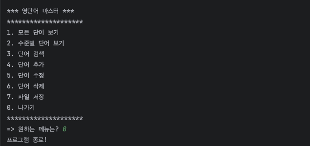

<h1>Word Master Project 실행화면</h1>
22200296 박소연

<h3>메뉴 보여주기</h3>

<h3>1번: 단어 리스트 보여주기</h3>

<h3>2번: 단어 리스트 보여주기</h3>

<h3>3번: 단어 검색하기</h3>

<h3>4번: 단어 추가하기</h3>

<h3>5번: </h3>

<h3>6번: </h3>

<h3>7번: </h3>

<h3>0번: 프로그램 종료</h3>

